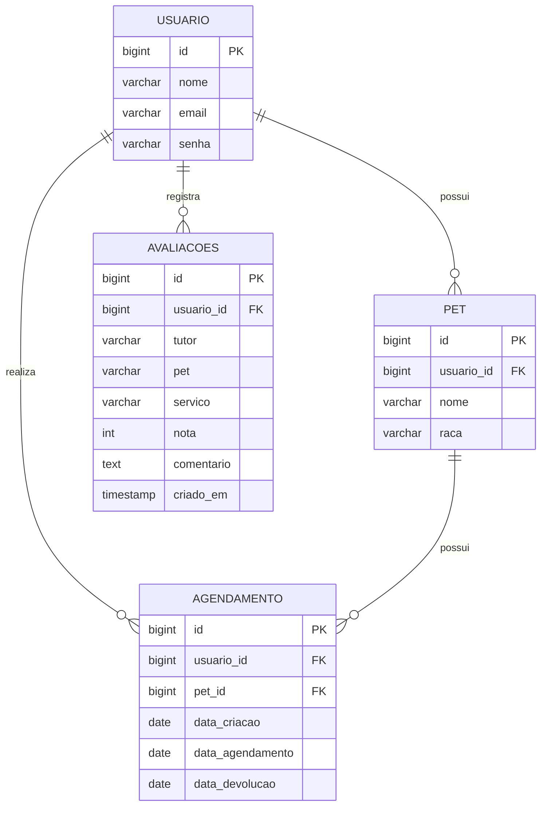

```mermaid
erDiagram
    USUARIO ||--o{ PET : possui
    USUARIO ||--o{ AGENDAMENTO : realiza
    PET ||--o{ AGENDAMENTO : possui
    USUARIO ||--o{ AVALIACOES : registra

    USUARIO {
        bigint id PK
        varchar nome
        varchar email
        varchar senha
    }

    PET {
        bigint id PK
        bigint usuario_id FK
        varchar nome
        varchar raca
    }

    AGENDAMENTO {
        bigint id PK
        bigint usuario_id FK
        bigint pet_id FK
        date data_criacao
        date data_agendamento
        date data_devolucao
    }

    AVALIACOES {
        bigint id PK
        bigint usuario_id FK
        varchar tutor
        varchar pet
        varchar servico
        int nota
        text comentario
        timestamp criado_em
    }
```